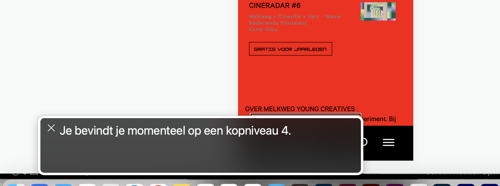
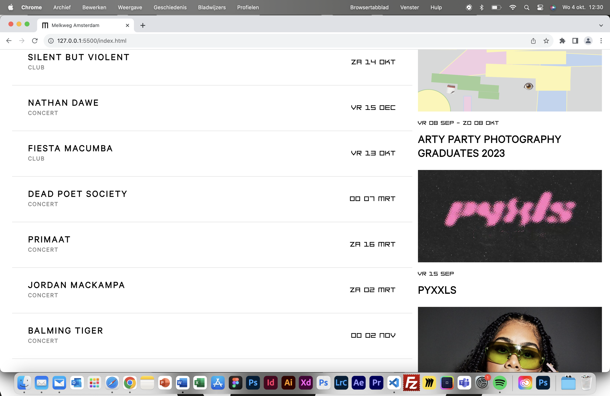

# Procesverslag
Markdown is een simpele manier om HTML te schrijven.  
Markdown cheat cheet: [Hulp bij het schrijven van Markdown](https://github.com/adam-p/markdown-here/wiki/Markdown-Cheatsheet).

Nb. De standaardstructuur en de spartaanse opmaak van de README.md zijn helemaal prima. Het gaat om de inhoud van je procesverslag. Besteedt de tijd voor pracht en praal aan je website.

Nb. Door *open* toe te voegen aan een *details* element kun je deze standaard open zetten. Fijn om dat steeds voor de relevante stuk(ken) te doen.

## Jij

  
uitwerken voor kick-off werkgroep

  ### Auteur:
Lin Greefkens

  #### Je startniveau:
Blauw

  #### Je focus:
Responsive
 

## Je website

  
uitwerken voor kick-off werkgroep

  ### Je opdracht:
  https://www.melkweg.nl/nl/

  #### Screenshot(s) van de eerste pagina (small screen): 
  Home  
  

  #### Screenshot(s) van de tweede pagina (small screen):
  Young Creatives 
  
 

## Toegankelijkheidstest 1/2 (week 1)

  
uitwerken na test in 2e werkgroep

  ### Bevindingen
  - met spasmes kun je lastig een website gebruiken
  - een screenreader is best lastig te volgen. 
    hij leest vaak dingen pas voor als je iets selecteert. Maar als je blind bent kun je dat niet zelf selecteren.
  - als je kleurenblind bent lijken de kleuren rood en groen op elkaar. hier moet je dus rekening 
    mee houden bij het designen van een website
  - als slechtziende is een groot contrast in een website erg prettig

## Breakdownschets (week 1)

  
uitwerken na afloop 3e werkgroep

  ### pagina 1: 
  

  ### pagina 2: 
  

## Voortgang 1 (week 2)

  
uitwerken voor 1e voortgang

  ### Stand van zaken
  Op zich loop ik redelijk op schema, denk ik. Ik heb niet echt een planning maar ik ga steeds aan de slag met wat op dat moment lukt. Ik heb diepe dalen en hoge pieken bij dit vak haha. Wanneer een onderdeel niet lukt ga ik aan de slag met een andere onderdeel, en bewaar ik het geen wat niet lukt voor een andere keer.
  Wat ik op dit moment lastig vind is het opbouwen van het Grid. Het is namelijk nogal een complexe vormgeving die niet op gelijke rijen en kollomen staat. Ook het responsive maken van sommige onderdelen lukt nog niet zo makkelijk, zoals bijvoorbeeld de h1. Waar ik ook wel een beetje tegenop zie is een animatie maken van de H1. Maar ik ga mijn best doen.

  Screenshots responsive H1:
  
  

  Screenshot Grid:
  

  ### Agenda voor meeting
  samen met je groepje opstellen

  | Lin Greefkens    | student 2          | student 3    | student 4        |
  | ---              | ---                | ---          | ---              |
  | site doorlopen   | en dit             | en ik dit    | en dan ik dat    |
  | onderdelen die   | dit als er tijd is | nog een punt | dit wil ik zeker |
  | nog niet lukken  | ...                | ...          | ...              |

  ### Verslag van meeting
  hier na afloop snel de uitkomsten van de meeting vastleggen

  - mijn vragen zijn beantwoord en ik kan weer verder met html css
    bijvoorbeeld: mijn grid lukte niet en daar kreeg ik tips bij. 
    en de knoppen op de home page lukte niet met Javascript. ook hier kreeg ik tips voor om weer verder te kunnen.

## Voortgang 2 (week 3)

  
uitwerken voor 2e voortgang

  ### Stand van zaken
  hier dit ging goed & dit was lastig (neem ook screenshots op van delen van je website en code)

  ### Agenda voor meeting
  samen met je groepje opstellen

  | student 1      | student 2          | student 3    | student 4        |
  | ---            | ---                | ---          | ---              |
  | dit bespreken  | en dit             | en ik dit    | en dan ik dat    |
  | en dat ook nog | dit als er tijd is | nog een punt | dit wil ik zeker |
  | ...            | ...                | ...          | ...              |

  ### Verslag van meeting
  hier na afloop snel de uitkomsten van de meeting vastleggen

  - pauline heeft mijn code nagekeken of alles netjes was. dat was, ik heb geen errors
  - mijn lettertype is op Safari niet zichtbaar, maar hier heb ik geen oplossing voor gevonden (samen naar gekeken met Danny en Thije)

## Toegankelijkheidstest 2/2 (week 4)

  
uitwerken na test in 9e werkgroep

  ### Bevindingen
hij geeft veel wel duidelijk aan. 

alleen is mijn alternatieve tekst niet heel duidelijk. het geeft nog niet aan wat er echt te zien is op de afbeeldingen.

de tekst 'gratis voor jaarleden' op pagina 2 is nu een H4. 
maar in de echte website is dat een knop. 
ik moet hier dus ook een knop van maken. anders leest de screenreader het verkeerd voor.
  

ook wordt mijn footer niet opgelezen.

## Voortgang 3 (week 4)

  
uitwerken voor 3e voortgang

  ### Stand van zaken
  ik had weer een lijstje met een aantal vragen voorbereid die ik afging met Danny.
  gedurende het voortgangsgesprek werden mijn vragen beantwoord en daar kon ik weer mee verder.

  Dit ging onder andere over het responsive maken, en hoe ik dit het best aan kon passen.
  Javascript werkte niet op beide pagina's, hoe kan ik dit het beste aanpakken.
  Mijn position Sticky werkt niet, hoe moet ik dit aanpakken. --> dit is inmiddels gelukt, maar nog niet optimaal.
  ik ga hier mee aan de slag in de hoop dat het beter wordt.

  ### Agenda voor meeting
  samen met je groepje opstellen

  | student 1      | student 2          | student 3    | student 4        |
  | ---            | ---                | ---          | ---              |
  | dit bespreken  | en dit             | en ik dit    | en dan ik dat    |
  | en dat ook nog | dit als er tijd is | nog een punt | dit wil ik zeker |
  | ...            | ...                | ...          | ...              |

  ### Verslag van meeting
  ik had weer een lijstje met een aantal vragen voorbereid die ik afging met Danny.
  gedurende het voortgangsgesprek werden mijn vragen beantwoord en daar kon ik weer mee verder.

  Dit ging onder andere over het responsive maken, en hoe ik dit het best aan kon passen.
  Javascript werkte niet op beide pagina's, hoe kan ik dit het beste aanpakken.
  Mijn position Sticky werkt niet, hoe moet ik dit aanpakken. --> dit is inmiddels gelukt, maar nog niet optimaal.
  ik ga hier mee aan de slag in de hoop dat het beter wordt.

## Eindgesprek (week 5)

  
uitwerken voor eindgesprek

  ### Je uitkomst - karakteristiek screenshots:
  
  
  
  

  ### Dit ging goed/Heb ik geleerd: 
  Ik heb heel veel nieuwe mogelijkheden ontdekt voor code. JavaScript vind ik wel nog erg lastig. 
  Maar ik heb hier wel veel nieuws over geleerd.

  

  ### Dit was lastig/Is niet gelukt:
  Position sticky vond ik wel heel lastig in het begin. Ik dacht dat dit makkelijk met 1 regel CSS zou kunnen.
  Maar dit was helaas niet zo. Ik heb hier veel tijd in gestoken, het werkt, maar niet zoals ik zou willen zoals het zou worden. 

  

## Bronnenlijst

  
continu bijhouden terwijl je werkt

  Nb. Wees specifiek ('css-tricks' als bron is bijv. niet specifiek genoeg). 
  Nb. ChatGpT en andere AI horen er ook bij.
  Nb. Vermeld de bronnen ook in je code.

  1. https://www.w3schools.com/tags/att_time_datetime.asp --> datum aangeven als datum ipv tekst
  2. https://developer.mozilla.org/en-US/docs/Web/CSS/@font-face --> eigen lettertype toevoegen
  3. https://www.w3schools.com/cssref/css3_pr_mediaquery.php --> responsive maken met mediaquery
  4. https://www.freecodecamp.org/news/media-query-css-example-max-and-min-screen-width-for-mobile-responsive-design/ --> formaten voor een mediaquery
  5. https://gathering.tweakers.net/forum/list_messages/1095246 --> footer vastzetten
  6. https://www.w3schools.com/css/css_grid.asp --> gridd css
  7. https://developer.mozilla.org/en-US/docs/Web/CSS/position --> position sticky
  
  en ik heb veel vragen gesteld aan ChatGPT

